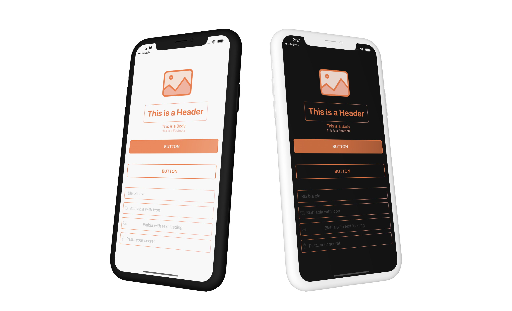
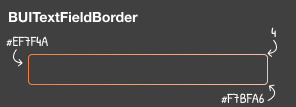
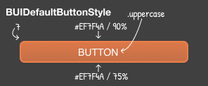
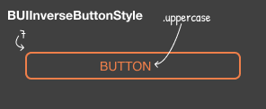
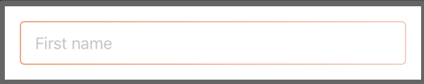
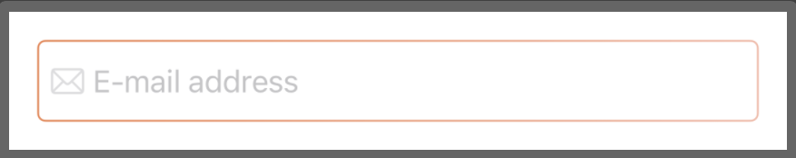
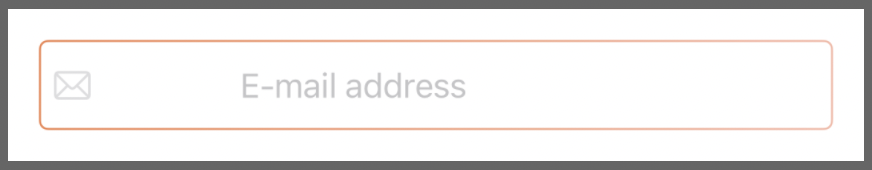
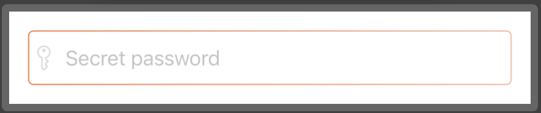
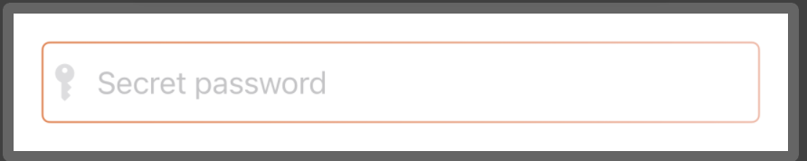
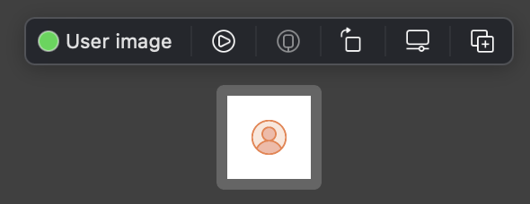

<p align="center">
	
</p>

# BetaUI Swift Package
## Creating fast prototypes in SwiftUI

Developer should focus on app logic instead of UI in the initial phase. Prebuild components allow to code the logic faster without too much compromise on the UI.

<p align="center">
	
</p>

## Components

### - Border
- DefaultTextFieldBorder ```BUIInputTextFiledBorder()```



### - Button
- Default button ```.modifier(BUIDefaultButtonStyle())```


- Inverse button ```.modifier(BUIInverseButtonStyle())```



### - Input
#### TextField

 ```
 BUIInputTextField(
		 text: Binding<String>
		 placeholder: String
		 keyboardType: (UIKeyboardType)
		 sfSymbol: String?
		 textLeading: CGFloat = 30
 )
 ```

 ##### Sample 1. - TextFiled without icon
 ```
 BUIInputTextField(text: $text,
                   placeholder: "First name",
                   keyboardType: .namePhonePad,
                   sfSymbol: nil)
 ```
 

 ##### Sample 2. - TextField with icon
 ```
 BUIInputTextField(text: $text,
                   placeholder: "E-mail address",
                   keyboardType: .emailAddress,
                   sfSymbol: "envelope")
 ```
 

 ##### Sample 3. - TextField with icon and with large text leading
 ```
 BUIInputTextField(text: $text,
                  placeholder: "E-mail address",
                  keyboardType: .emailAddress,
                  sfSymbol: "envelope",
                  textLeading: 100)
 ```
 
 
- SecureTextFiled

 ```
 BUISecureTextField(
		 text: Binding<String>
		 placeholder: String
		 keyboardType: (UIKeyboardType)
		 sfSymbol: String = "key"
		 textLeading: CGFloat = 30
 )
 ```
 ##### Sample 1. - SecureTextFiled with default "key" icon
 ```
 BUISecureTextField(password: .$password,
                    placeholder: "Secret password", 
                    keyboardType: .default)
 ```
 

 ##### Sample 2. - TextField with custom "key.fill" icon
 ```
 BUISecureTextField(password: .$password,
                    placeholder: "Secret password", 
                    keyboardType: .default,
                    sfSymbol: "key.fill")
 ```
 


#### - Textstyle (as ViewModifier)
- Header ```.modifier(BUIHeaderText())```
- Body ```.modifier(BUIBodyText())```
- Footnote ```.modifier(BUIFootnoteText())```

### Images

- ```BUILogoImage(imageWidth: CGFloat, imageHeight: CGFloat)``` - default value is 150
- ```BUIUserImage(imageWidth: CGFloat, imageHeight: CGFloat)``` - default value is 30

### Extension
#### - Colors
Default colors are stored in ```Media.xcassets``` file.

-   ```kMainColor1``` = "EF7F4A" 
-    ```kMainColor2``` = "F7B7A6"
-  ```kMainColor3``` = "FCE5DB"   
-  ```kMainColor4``` = "FFFFFF"

You can use colors with hex values: ```Color(hexString: "yourColorHexValue")```

#### - View
Preview extension limits the preview the size of the elements.

```.preview(with: "YourTitleOfPreview")```


