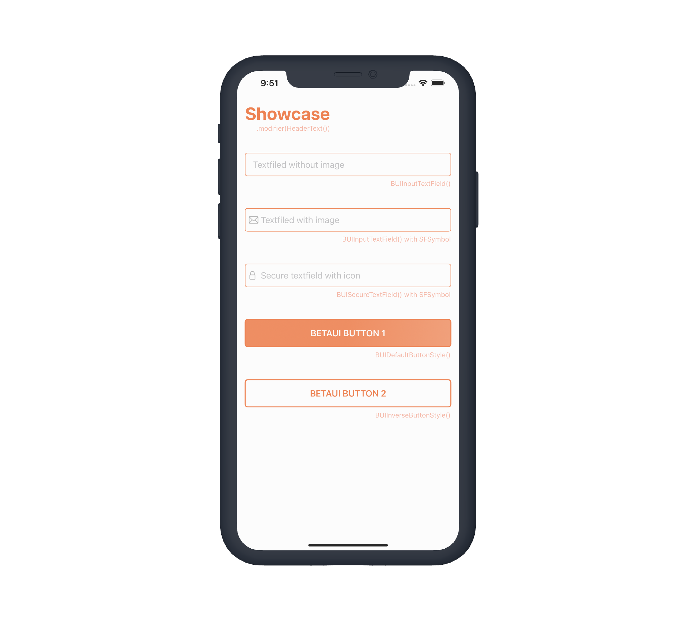

# BetaUI Swift Package
## Creating fast prototypes in SwiftUI, focusing on app logic instead of UI



### Components

#### - Border
- DefaultTextFieldBorder ```BUIInputTextFiledBorder()```
#### - Button
- ```BUIDefaultButtonStyle```
- ```BUIInverseButtonStyle```
#### - Input
- TextField
 
 ```
 BUIInputTextField(
		 text: Binding<String>
		 placeholder: String
		 keyboardType: (UIKeyboardType)
		 sfSymbol: String?
 )
 ```
 
- SecureTextFiled

 ```
 BUISecureTextField(
		 text: Binding<String>
		 placeholder: String
		 keyboardType: (UIKeyboardType)
		 sfSymbol: String?
 )
 ```
#### - Textstyle (as ViewModifier)
- Header ```.modifier(BUIHeaderText())```
- Body ```.modifier(BUIBodyText())```
- Footnote ```.modifier(BUIFootnoteText())```

### Extension
#### - Colors
Default colors are stored in ```Media.xcassets``` file.

- ```kMainColor1``` = "EF7F4A"
- ```kMainColor2``` = "F7B7A6"
- ```kMainColor3``` = "FCE5DB"
- ```kMainColor4``` = "FFFFFF"

You can use colors with hex values: ```Color(hexString: "yourColorHexValue")```
#### - View
